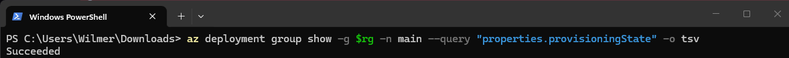
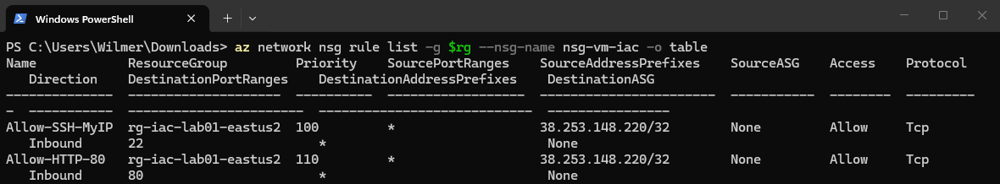
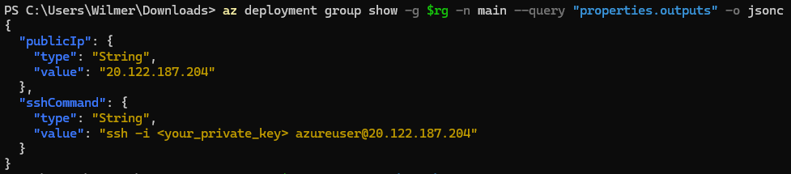
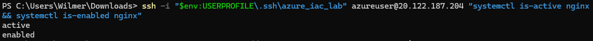
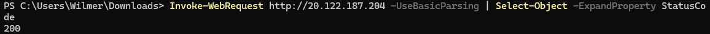
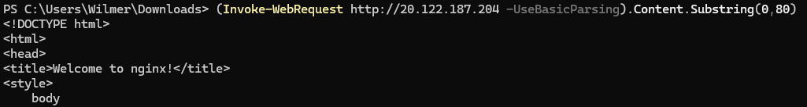

# Lab 01 — Azure IaC with Bicep (Ubuntu VM + VNet + NSG + Nginx)

This lab deploys a **Linux VM (Ubuntu 22.04 LTS)** and the required networking using **Azure Bicep + Azure CLI**, then installs **Nginx** and validates access over HTTP.

## What gets deployed

- Resource Group (created via CLI)
- Virtual Network + Subnet
- Network Security Group (NSG)
  - **SSH (22)** allowed **only from your public IP (/32)**
  - **HTTP (80)** allowed from `httpSource` (default `*`, recommended your IP `/32`)
- Public IP (Static, Standard SKU)
- NIC attached to the subnet and Public IP
- Ubuntu VM (Gen2 image)

## Architecture (high level)

```
Your PC (public IP /32)
        |
        |  TCP 22, TCP 80 (restricted by NSG)
        v
   Public IP (Static)
        |
        v
      NIC  --->  Subnet  --->  VNet
        |
        v
   Ubuntu VM (sshd + nginx)
```

## Files

- `main.bicep` — IaC template (VM + networking + outputs)
- `screenshots/` — evidence for the lab
- `.gitignore` — prevents committing sensitive files (SSH keys, logs, etc.)

## Prerequisites

- Azure subscription + permissions to create resources
- Azure CLI installed and authenticated (`az login`)
- Bicep CLI (Azure CLI installs it automatically)
- SSH key pair (we only pass the **public key** to Azure)

## Parameters (Bicep)

| Parameter | Description | Example |
|---|---|---|
| `location` | Location for all resources. Default is the RG location, but you can override from CLI. | `eastus2` |
| `vmSize` | VM size (availability varies by region/subscription). | `Standard_D2s_v3` |
| `myIpCidr` | Your public IP in CIDR format to allow SSH | `38.253.148.220/32` |
| `sshPublicKey` | The content of your `.pub` key | `ssh-ed25519 AAAA...` |
| `httpSource` | Source for HTTP 80 (`*` for public demo, or your IP `/32`) | `38.253.148.220/32` |

## Quick start (Windows PowerShell)

> Tip: if you hit `SkuNotAvailable`, try a different `vmSize` or a different region (availability depends on subscription capacity).

```powershell
# 1) Set location and RG
$loc = "eastus2"
$rg  = "rg-iac-lab01-$loc"
az group create -n $rg -l $loc | Out-Null

# 2) Your public IP (CIDR) for SSH
$myIpCidr = (Invoke-RestMethod -Uri "https://api.ipify.org") + "/32"

# 3) Create SSH key (example name used in this lab)
ssh-keygen -t ed25519 -f "$env:USERPROFILE\.sshzure_iac_lab" -N ""
$pub = Get-Content "$env:USERPROFILE\.sshzure_iac_lab.pub" -Raw

# 4) Validate
az deployment group validate `
  --resource-group $rg `
  --template-file .\main.bicep `
  --parameters location=$loc vmSize="Standard_D2s_v3" myIpCidr="$myIpCidr" sshPublicKey="$pub"

# 5) Deploy
az deployment group create `
  --resource-group $rg `
  --template-file .\main.bicep `
  --parameters location=$loc vmSize="Standard_D2s_v3" myIpCidr="$myIpCidr" sshPublicKey="$pub"
```

### Get outputs (public IP + SSH command)

```powershell
az deployment group show -g $rg -n main --query "properties.outputs" -o jsonc
$ip = az network public-ip show -g $rg -n pip-vm-iac-ubuntu-01 --query ipAddress -o tsv
```

### SSH into the VM

```powershell
ssh -i "$env:USERPROFILE\.sshzure_iac_lab" azureuser@$ip
```

## Install and validate Nginx

Run these **inside the VM**:

```bash
sudo apt update && sudo apt -y upgrade
sudo apt -y install nginx
sudo systemctl enable --now nginx

# local check
curl -I http://localhost
```

Back on **Windows PowerShell**:

```powershell
Invoke-WebRequest http://$ip -UseBasicParsing | Select-Object -ExpandProperty StatusCode
(Invoke-WebRequest http://$ip -UseBasicParsing).Content.Substring(0,80)
```

## Evidence (screenshots)

> These screenshots are included in `screenshots/`.

### 1) Deployed resources in the Resource Group


### 2) Deployment succeeded


### 3) NSG rules (SSH + HTTP)


### 4) Deployment outputs (Public IP + SSH command)


### 5) Nginx is active and enabled


### 6) HTTP returns 200 from the VM public IP


### 7) HTML content starts with the Nginx welcome page


## Security notes

- SSH is restricted to `myIpCidr` (your public IP `/32`).
- For HTTP, you can:
  - keep `httpSource="*"` only for a public demo, or
  - restrict it to your IP `/32` (recommended)

To restrict HTTP after deployment (example):

```powershell
az network nsg rule update `
  -g $rg `
  --nsg-name nsg-vm-iac `
  -n Allow-HTTP-80 `
  --source-address-prefixes $myIpCidr
```

## Cleanup (avoid charges)

```powershell
az group delete -n $rg --yes --no-wait
```

## Troubleshooting

- **`SkuNotAvailable`**: the VM size is not available for your subscription in that region at that moment. Pick another `vmSize` or region and retry.
- **SSH “Permission denied (publickey)”**: ensure you connect with the same private key used to generate the `.pub` you passed to `sshPublicKey`.
- **HTTP timeout**: verify NSG allows inbound 80 from your source and Nginx is running (`systemctl is-active nginx`).
