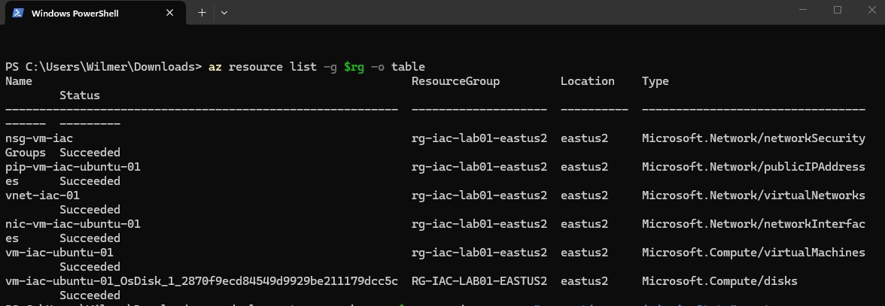

# Lab 01 — Azure IaC with Bicep (Ubuntu VM + VNet + NSG + Nginx)

This lab demonstrates a complete **Infrastructure as Code (IaC)** workflow on Azure using **Bicep + Azure CLI**.  
It deploys an **Ubuntu 22.04 LTS VM**, the required networking (VNet/Subnet/NSG/Public IP/NIC), then installs **Nginx** and validates **HTTP connectivity (200 OK)** from the public internet (optionally restricted to your IP).

---

## What gets deployed

- **Resource Group** (created via Azure CLI)
- **Virtual Network (VNet)** + **Subnet**
- **Network Security Group (NSG)** with inbound rules:
  - **SSH (22)** allowed **only from your public IP (/32)** via `myIpCidr`
  - **HTTP (80)** allowed from `httpSource` (default `*`, recommended your IP `/32`)
- **Public IP** (Static, Standard SKU)
- **Network Interface (NIC)** attached to subnet + public IP
- **Ubuntu VM** (Gen2 image)

---

## Architecture (high level)

```text
Your PC (public IP /32)
        |
        |  TCP 22, TCP 80 (restricted by NSG)
        v
   Public IP (Static)
        |
        v
      NIC  --->  Subnet  --->  VNet
        |
        v
   Ubuntu VM (sshd + nginx)
```

---

## Repository structure

- `main.bicep` — Bicep template (VM + networking + outputs)
- `screenshots/` — evidence for the lab
- `.gitignore` — prevents committing sensitive/unnecessary files (SSH keys, logs, temp files, etc.)

---

## Prerequisites

- An **Azure subscription** with permissions to create resources
- **Azure CLI** installed and authenticated (`az login`)
- **Bicep CLI** (Azure CLI installs it automatically)
- **SSH key pair** (only the **public key** is passed to Azure)

---

## Bicep parameters

| Parameter | Description | Example |
|---|---|---|
| `location` | Azure region for resources. Default is the RG location, but can be overridden from CLI. | `eastus2` |
| `vmSize` | VM size (availability varies by region/subscription capacity). | `Standard_D2s_v3` |
| `myIpCidr` | Your public IP in CIDR format to allow SSH inbound. | `38.253.148.220/32` |
| `sshPublicKey` | The content of your `.pub` key (single line). | `ssh-ed25519 AAAA...` |
| `httpSource` | Source allowed for HTTP 80 (`*` for public demo or your IP `/32`). | `38.253.148.220/32` |

---

## Quick start (Windows PowerShell)

> If you hit **`SkuNotAvailable`**, switch `vmSize` and/or `location`. Availability depends on subscription capacity in that region.

```powershell
# 1) Set location and Resource Group
$loc = "eastus2"
$rg  = "rg-iac-lab01-$loc"
az group create -n $rg -l $loc | Out-Null

# 2) Detect your public IP and format as /32 for NSG SSH rule
$myIpCidr = (Invoke-RestMethod -Uri "https://api.ipify.org") + "/32"

# 3) Create SSH key pair (lab key name)
ssh-keygen -t ed25519 -f "$env:USERPROFILE\.ssh\azure_iac_lab" -N ""
$pub = Get-Content "$env:USERPROFILE\.ssh\azure_iac_lab.pub" -Raw

# 4) Validate deployment
az deployment group validate `
  --resource-group $rg `
  --template-file .\main.bicep `
  --parameters location=$loc vmSize="Standard_D2s_v3" myIpCidr="$myIpCidr" sshPublicKey="$pub"

# 5) Deploy
az deployment group create `
  --resource-group $rg `
  --template-file .\main.bicep `
  --parameters location=$loc vmSize="Standard_D2s_v3" myIpCidr="$myIpCidr" sshPublicKey="$pub"
```

---

## Get outputs (Public IP + SSH command)

```powershell
az deployment group show -g $rg -n main --query "properties.outputs" -o jsonc
$ip = az network public-ip show -g $rg -n pip-vm-iac-ubuntu-01 --query ipAddress -o tsv
$ip
```

---

## SSH into the VM

```powershell
ssh -i "$env:USERPROFILE\.ssh\azure_iac_lab" azureuser@$ip
```

---

## Install and validate Nginx

Run these commands **inside the VM**:

```bash
sudo apt update && sudo apt -y upgrade
sudo apt -y install nginx
sudo systemctl enable --now nginx

# Local validation on the VM
curl -I http://localhost
```

Back on **Windows PowerShell**:

```powershell
Invoke-WebRequest http://$ip -UseBasicParsing | Select-Object -ExpandProperty StatusCode
(Invoke-WebRequest http://$ip -UseBasicParsing).Content.Substring(0,80)
```

---

## Evidence (screenshots)

All screenshots are located in `./screenshots/`.

### 1) Deployed resources in the Resource Group


### 2) Deployment provisioningState: Succeeded


### 3) NSG rules (SSH + HTTP)


### 4) Deployment outputs (Public IP + SSH command)


### 5) Nginx service is active and enabled


### 6) HTTP returns 200 from the VM public IP


### 7) HTML begins with the Nginx welcome page


---

## Security notes

- SSH is restricted to **your public IP** (`myIpCidr`).
- For HTTP, you can:
  - keep `httpSource="*"` only for a public demo, **or**
  - restrict it to your IP `/32` (recommended)

Restrict HTTP after deployment (example):

```powershell
az network nsg rule update `
  -g $rg `
  --nsg-name nsg-vm-iac `
  -n Allow-HTTP-80 `
  --source-address-prefixes $myIpCidr
```

---

## Cleanup (avoid charges)

```powershell
az group delete -n $rg --yes --no-wait
```

Optional: confirm deletion

```powershell
az group exists -n $rg
```

---

## Troubleshooting

- **`SkuNotAvailable`**: try another `vmSize` and/or region (`location`).
- **SSH: `Permission denied (publickey)`**: ensure you connect using the same private key that matches the public key sent in `sshPublicKey`.
- **HTTP timeout**: verify NSG inbound rule allows port 80 from your source and Nginx is running (`systemctl is-active nginx`).
