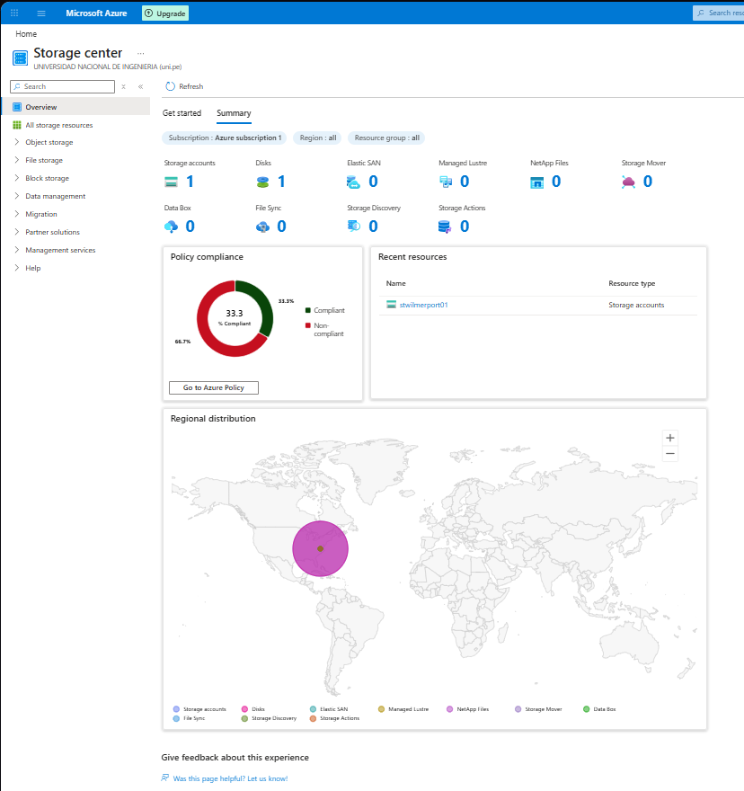
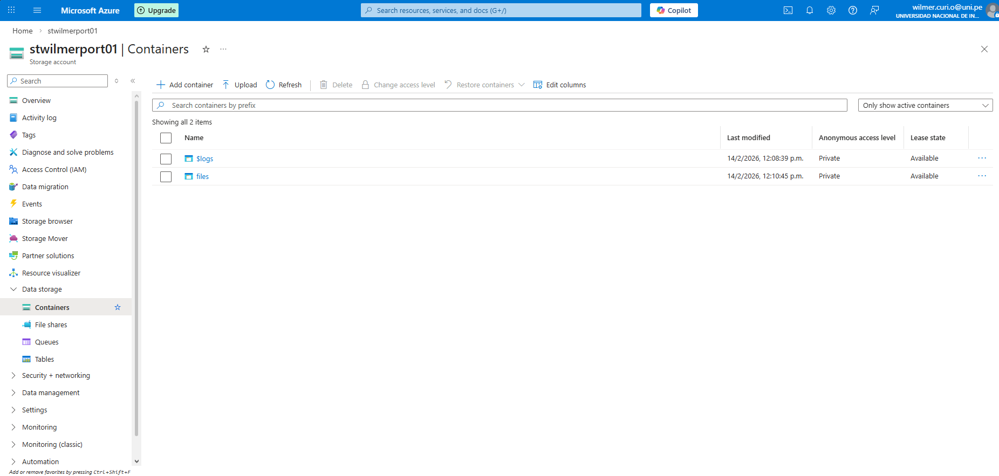
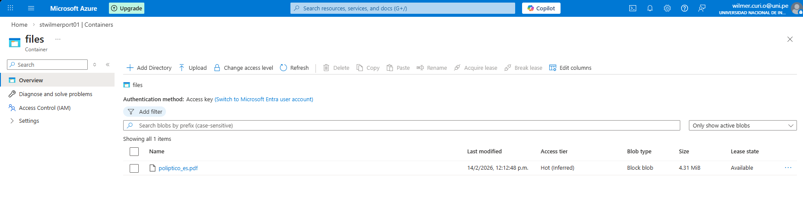
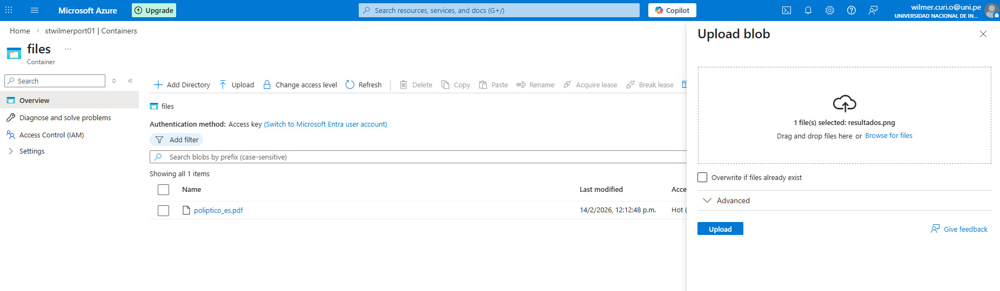
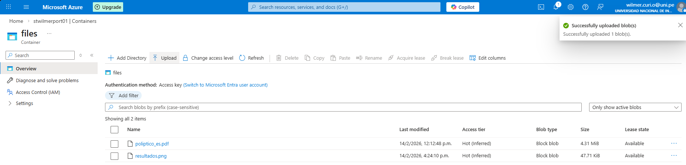
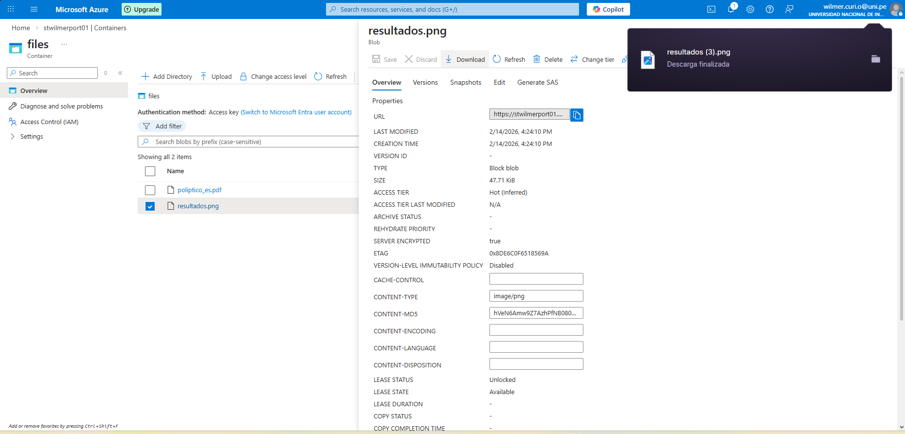

# Lab 02 — Azure Storage (Blob)

## Goal
Create a Storage Account, create a Blob container, upload and download a file, and validate access settings.

## Evidence (Screenshots)
All screenshots are in `./screenshots/`.

1) Storage Center / storage account visible  

2) Storage account → Containers  

3) Container `files` — blobs list  

4) Upload blob panel  

5) Upload success (blob appears / success message)  

6) Blob properties + download  

7) Access level change blocked / container privacy evidence  

