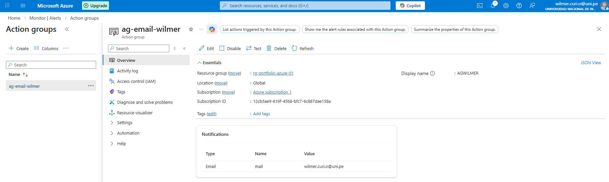
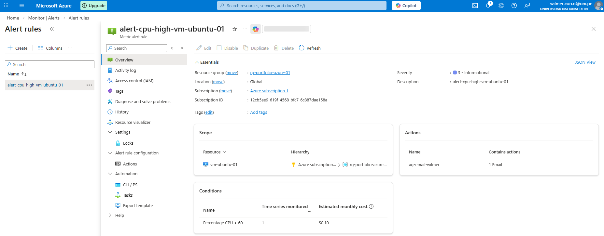
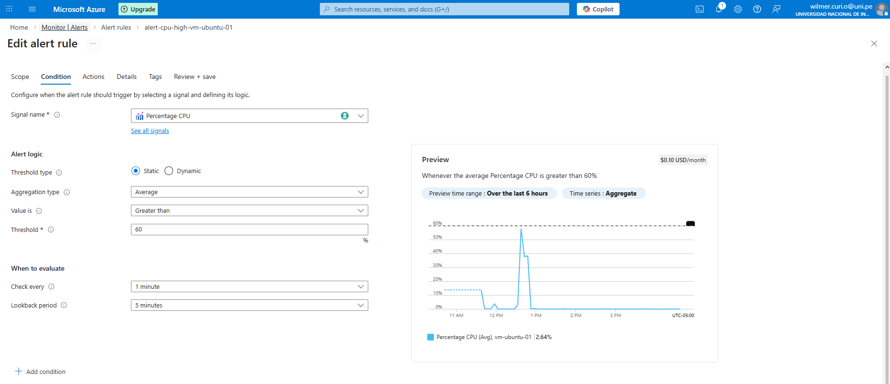
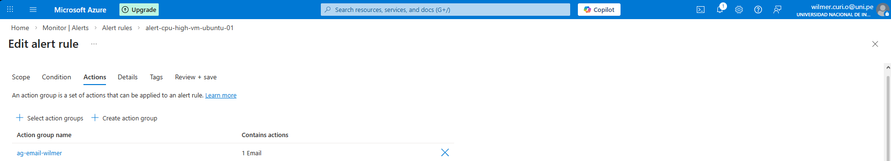
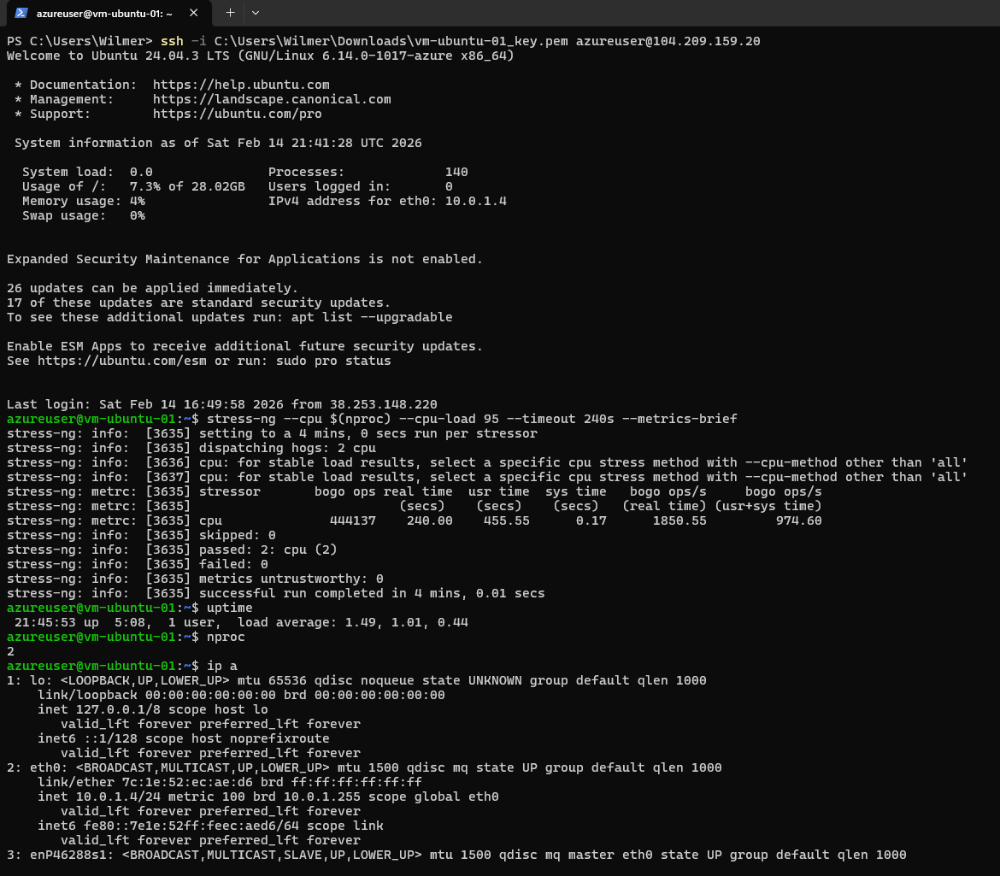
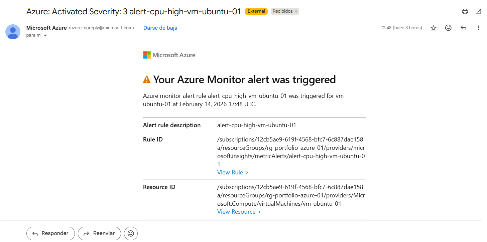
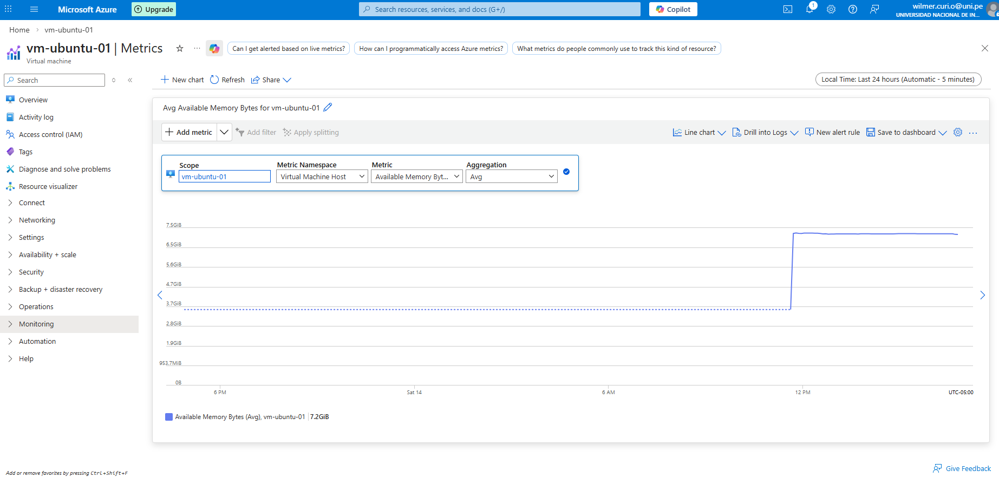

# Lab 03 — Monitoring + Alerts (Azure Monitor)

## Goal
Create an Azure Monitor alert rule (CPU), configure an Action Group (email), trigger the alert with a stress test, and verify notification.

## Evidence (Screenshots)
All screenshots are in `./screenshots/`.

1) Action Group overview  

2) Alert rule overview  

3) Alert rule condition (CPU threshold)  

4) Alert rule actions (Action Group selected)  

5) Stress test on VM (stress-ng)  

6) VM alerts list / fired alert  

7) Email notification received  

8) Metrics chart  

