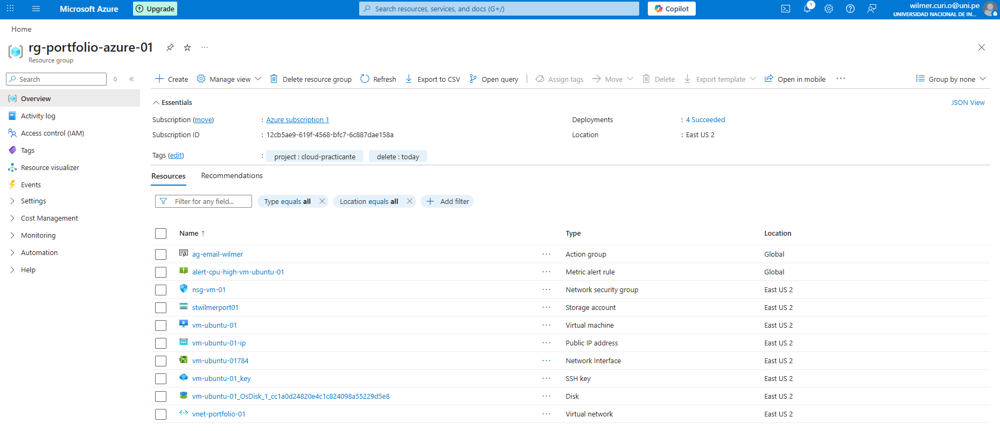
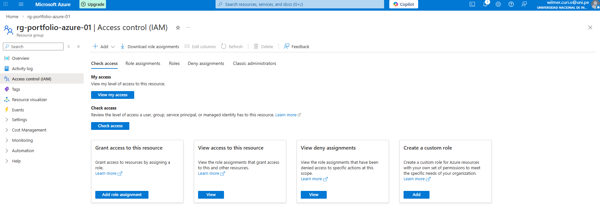
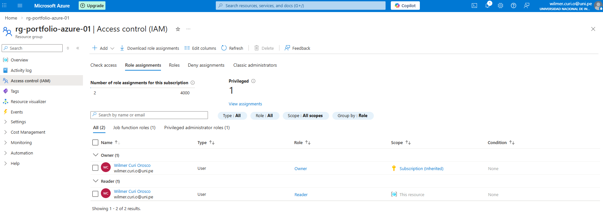
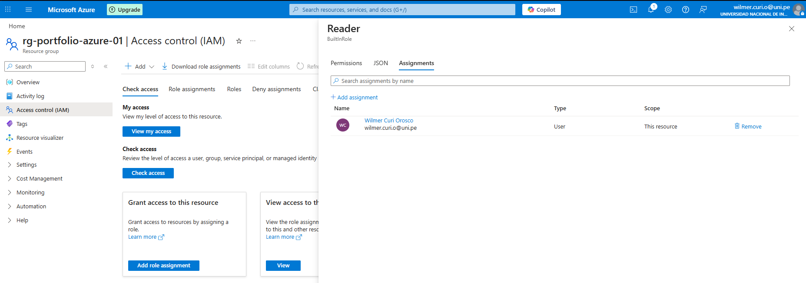
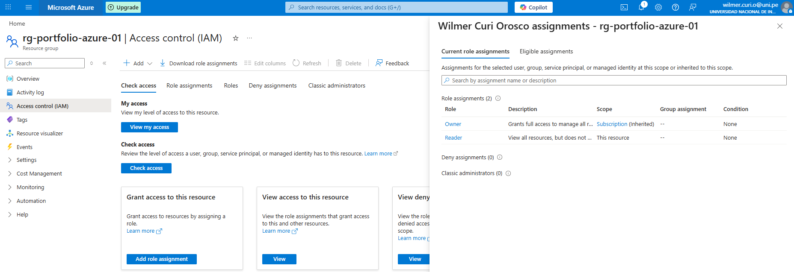

# Lab 04 — RBAC (IAM)

## Goal
Assign an RBAC role at Resource Group scope and verify role assignments and effective access.

## Evidence (Screenshots)
All screenshots are in `./screenshots/`.

1) Resource Group overview (scope)  

2) IAM — Check access  

3) IAM — Role assignments  

4) Reader role — Assignments tab (shows scope)  

5) Role assignments (Reader entry visible)  

6) My access / View assignments panel  

